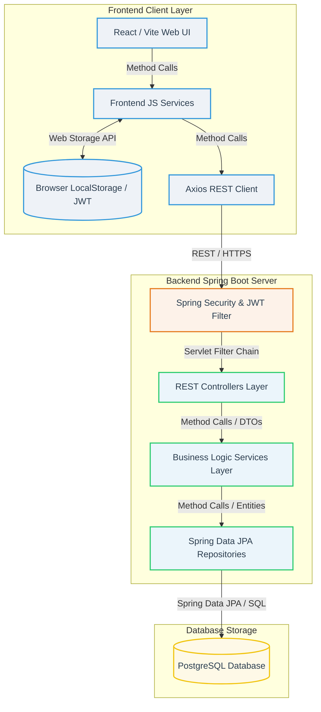

```mermaid
graph TD
%% Custom Styling
    classDef client fill:#eef2f7,stroke:#3498db,stroke-width:2px,color:#2c3e50;
    classDef security fill:#fdf2e9,stroke:#e67e22,stroke-width:2px,color:#2c3e50;
    classDef application fill:#ebf5fb,stroke:#2ecc71,stroke-width:2px,color:#2c3e50;
    classDef database fill:#fef9e7,stroke:#f1c40f,stroke-width:2px,color:#2c3e50;

    subgraph FE [Frontend Client Layer]
        UI[React / Vite Web UI]:::client
        Services[Frontend JS Services]:::client
        Store[(Browser LocalStorage / JWT)]:::client
        Axios[Axios REST Client]:::client
    end

    subgraph BE [Backend Spring Boot Server]
        AuthFilter[Spring Security & JWT Filter]:::security
        Controller[REST Controllers Layer]:::application
        Service[Business Logic Services Layer]:::application
        Repo[Spring Data JPA Repositories]:::application
    end

    subgraph DB [Database Storage]
        Postgres[(PostgreSQL Database)]:::database
    end

%% Component Connectors & Protocols
    UI -->|Method Calls| Services
    Services <-->|Web Storage API| Store
    Services -->|Method Calls| Axios
    Axios -->|REST / HTTPS| AuthFilter
    AuthFilter -->|Servlet Filter Chain| Controller
    Controller -->|Method Calls / DTOs| Service
    Service -->|Method Calls / Entities| Repo
    Repo -->|Spring Data JPA / SQL| Postgres
```